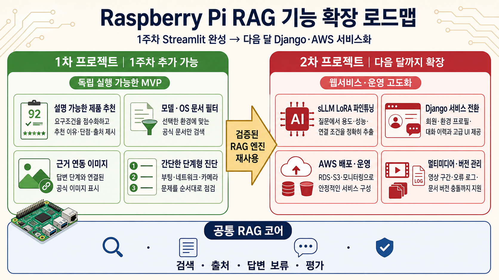
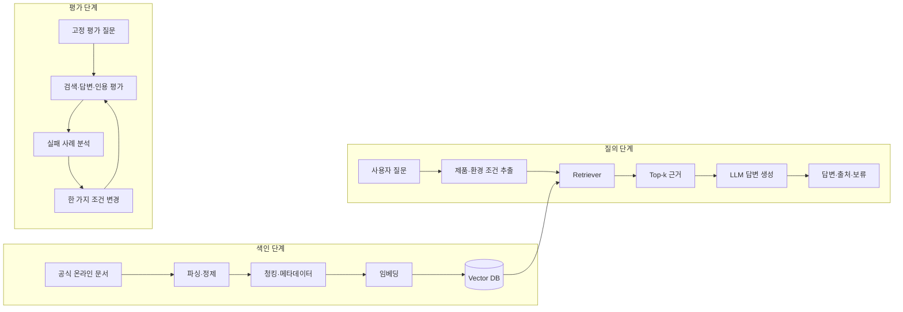

# Raspberry Pi Assistant

> Raspberry Pi 공식 문서 기반 제품 추천·비교 및 사용 지원 RAG

**Raspberry Pi 사용자와 교육 담당자가 프로젝트 목적에 맞는 모델을 선택하고 설치·설정·문제 해결 방법을 판단할 수 있도록, 라이선스가 확인된 공식 문서를 검색하여 비교 근거와 출처가 포함된 답변을 제공하는 RAG 서비스입니다.**

> [!IMPORTANT]
> 이 프로젝트는 교육 목적으로 제작하는 비공식 프로젝트이며 Raspberry Pi Ltd의 공식 서비스, 제휴 서비스 또는 보증을 받은 서비스가 아닙니다.

## 프로젝트 개요

| 구분 | 내용 |
|---|---|
| 핵심 사용자 | Raspberry Pi 입문자·프로젝트 제작자·교육 담당자 |
| 지원하는 판단 | 목적에 맞는 제품 선택, 제품 비교, 설치·설정, 문제 해결 |
| 핵심 근거 | 출처·작성 주체·라이선스·버전을 확인한 Raspberry Pi 공식 온라인 문서 |
| 제공 결과 | 추천·비교표·사용 절차·문제 해결 단계·근거 문서·원문 링크 |
| 핵심 원칙 | 검색된 공식 문서로 확인할 수 있는 내용만 답하고, 근거가 부족하면 답변을 보류 |

일반 LLM의 기억에만 의존하면 제품·운영체제·설정 버전이 섞이거나 출처를 확인하기 어렵습니다. 이 프로젝트는 질문과 관련된 공식 문서를 먼저 검색하고, 검색 결과에 근거해 답변과 인용을 생성합니다.

## 답변 범위

### 답변하는 질문

- 프로젝트 목적에 적합한 Raspberry Pi 제품 후보와 선택 근거
- Raspberry Pi 제품 2~3개의 공식 사양 및 용도 비교
- Raspberry Pi OS 설치와 초기 설정
- 네트워크, SSH·원격 접속, 카메라 및 기본 GPIO 사용법
- 부팅·네트워크·카메라 문제의 단계별 점검 방법

### 답변하지 않거나 보류하는 질문

- 공식 문서에서 확인되지 않는 성능·호환성 단정
- 가격, 실시간 재고 및 판매처 순위
- 제3자 액세서리의 품질·호환성 보증
- 비공식 오버클럭·개조·우회 방법
- 출처가 없거나 현재 문서 버전과 맞지 않는 질문

## 개발 범위

### 1차 프로젝트 — Streamlit RAG

1차 프로젝트만으로 설치·실행·평가가 가능한 완제품을 목표로 합니다.

- 제품 5종 내외의 목적 기반 추천
- 제품 2~3개 비교표
- 공식 온라인 문서 30~50개 수집·정제·색인
- Dense Retrieval 기반 Top-k 검색
- 사용법 및 문제 해결 Q&A
- 답변별 문서 제목·섹션·원문 링크 표시
- 근거 부족 시 답변 보류
- 프롬프트 인젝션 및 비밀정보 노출 방지
- Dev/Holdout을 포함한 평가 질문 50개
- Streamlit 사용자 화면과 근거 문서 확인 기능

#### 1차 추가 구현 후보

- 요구조건을 점수화한 설명 가능한 제품 추천
- 제품 모델·OS 버전 기반 metadata filter
- 답변 단계와 연결된 라이선스 확인 이미지 표시
- 부팅·네트워크·카메라의 간단한 단계형 진단

### 2차 프로젝트 — Django·AWS 확장

- sLLM과 LoRA를 활용한 사용자 요구조건 구조화 실험
- Django 기반 회원·환경 프로필·대화 이력 관리
- 제품 비교 및 문제 해결에 특화된 반응형 UI
- 영상 구간·오류 로그 등 멀티미디어 지원
- 문서 버전·충돌·갱신 관리
- AWS 기반 배포, 비밀정보 관리, 로그 및 모니터링



## 주요 화면

| 화면 | 주요 기능 |
|---|---|
| 홈 | 서비스 소개, 답변 범위와 사용 방법 안내 |
| 제품 추천 | 용도·성능·연결 조건에 따른 제품 후보와 추천 근거 제공 |
| 제품 비교 | 2~3개 제품의 핵심 사양·장단점·적합 용도 비교 |
| 사용법 Q&A | 제품과 OS 환경에 맞는 공식 문서 기반 답변 |
| 문제 해결 | 증상별 점검 순서와 관련 근거 문서 안내 |
| 출처·문서 | 문서 출처, 수집일, 버전, 라이선스와 원문 확인 |

## 기준 아키텍처



## 공식 문서 출처

핵심 corpus는 라이선스와 변경 이력을 확인하기 쉬운 **Raspberry Pi 공식 온라인 문서**를 우선 사용합니다. 아래 링크는 최초 수집 후보이며 실제 색인 여부·수집일·checksum은 Document Card와 manifest에서 관리합니다.

### 핵심 온라인 문서

| 영역 | 공식 문서 | 활용 목적 |
|---|---|---|
| 문서 홈 | [Raspberry Pi Documentation](https://www.raspberrypi.com/documentation/) | 전체 문서 탐색과 최신 목차 확인 |
| 제품·하드웨어 | [Raspberry Pi computer hardware](https://www.raspberrypi.com/documentation/computers/raspberry-pi.html) · [원문 AsciiDoc](https://github.com/raspberrypi/documentation/blob/master/documentation/asciidoc/computers/raspberry-pi/introduction.adoc) | 제품 계열, 사양, 포트와 하드웨어 비교 |
| 시작하기 | [Getting started](https://www.raspberrypi.com/documentation/computers/getting-started.html) · [OS 설치 원문](https://github.com/raspberrypi/documentation/blob/master/documentation/asciidoc/computers/getting-started/install.adoc) | 준비물, OS 설치, 데스크톱·헤드리스 설정 |
| 운영체제 | [Raspberry Pi OS](https://www.raspberrypi.com/documentation/computers/os.html) · [OS 소개 원문](https://github.com/raspberrypi/documentation/blob/master/documentation/asciidoc/computers/os/rpi-os-introduction.adoc) | OS 특성, 설치, 패키지와 업데이트 |
| 환경 설정 | [Configuration](https://www.raspberrypi.com/documentation/computers/configuration.html) | GUI, raspi-config, 네트워크와 시스템 설정 |
| 네트워크 | [Networking](https://www.raspberrypi.com/documentation/computers/configuration.html#networking) · [원문 AsciiDoc](https://github.com/raspberrypi/documentation/blob/master/documentation/asciidoc/computers/configuration/configuring-networking.adoc) | 호스트명, DHCP, 고정 IP, Wi-Fi와 nmcli |
| 원격 접속 | [Remote access](https://www.raspberrypi.com/documentation/computers/remote-access.html) · [SSH 원문](https://github.com/raspberrypi/documentation/blob/master/documentation/asciidoc/computers/remote-access/ssh.adoc) | SSH, VNC, Connect 및 파일 전송 |
| 카메라 하드웨어 | [Camera](https://www.raspberrypi.com/documentation/accessories/camera.html) · [설치 원문](https://github.com/raspberrypi/documentation/blob/master/documentation/asciidoc/accessories/camera/install.adoc) | 카메라 모델, 케이블, 커넥터와 장착 |
| 카메라 소프트웨어 | [Camera software](https://www.raspberrypi.com/documentation/computers/camera_software.html) · [rpicam-apps 원문](https://github.com/raspberrypi/documentation/blob/master/documentation/asciidoc/computers/camera/rpicam_apps_intro.adoc) | rpicam-apps, Picamera2, 촬영과 문제 해결 |
| GPIO | [GPIO and the 40-pin header](https://www.raspberrypi.com/documentation/computers/raspberry-pi.html#gpio-and-the-40-pin-header) · [원문 AsciiDoc](https://github.com/raspberrypi/documentation/blob/master/documentation/asciidoc/computers/raspberry-pi/gpio-on-raspberry-pi.adoc) | 핀 배열, BCM 번호, 인터페이스와 배선 안전 |
| 기본 문제 해결 | [Getting started: Troubleshooting](https://www.raspberrypi.com/documentation/computers/getting-started.html#troubleshooting) · [LED 경고 코드 원문](https://github.com/raspberrypi/documentation/blob/master/documentation/asciidoc/computers/configuration/led_blink_warnings.adoc) | 부팅 실패, SD 카드, 전원과 상태 LED 점검 |
| 원문·변경 이력 | [raspberrypi/documentation](https://github.com/raspberrypi/documentation) | 원문 파일, commit과 변경 이력 추적 |
| 라이선스 | [Raspberry Pi Licensing](https://www.raspberrypi.com/licensing/) · [공식 LICENSE](https://github.com/raspberrypi/documentation/blob/master/LICENSE.md) | 문서별 이용·수정·재배포 조건 확인 |

### 제품별 공식 참고 페이지

제품 페이지는 제품명과 최신 공식 사양을 교차 확인하고 사용자에게 원문을 안내하는 용도로 사용합니다. 온라인 문서 corpus와 동일한 라이선스라고 가정하지 않으며, 색인 전 페이지별 이용 조건을 별도로 확인합니다.

- [Raspberry Pi 5](https://www.raspberrypi.com/products/raspberry-pi-5/)
- [Raspberry Pi 4 Model B](https://www.raspberrypi.com/products/raspberry-pi-4-model-b/)
- [Raspberry Pi 500](https://www.raspberrypi.com/products/raspberry-pi-500/)
- [Raspberry Pi 400](https://www.raspberrypi.com/products/raspberry-pi-400/)
- [Raspberry Pi Zero 2 W](https://www.raspberrypi.com/products/raspberry-pi-zero-2-w/)

## Document Card 초안

| 항목 | 현재 계획 |
|---|---|
| 문서 집합 | Raspberry Pi 컴퓨터·OS·설정·원격 접속·카메라 관련 공식 온라인 문서 30~50개 |
| 출처 | raspberrypi.com/documentation, 공식 문서 GitHub 저장소 및 검증된 공식 제품 페이지 |
| 최초 확인일 | 2026-08-27 |
| 권리와 보안 | 공개 문서만 사용하며 개인정보·API Key·내부 문서는 수집하지 않음 |
| 버전 | 수집일, 원문 URL, Git commit 또는 갱신 시점, checksum 기록 |
| 구조 | 제목·섹션·목록·코드 블록·표·이미지 설명·원문 anchor 보존 |
| 처리 방법 | HTML/AsciiDoc 파싱, 반복 UI 제거, 섹션 기반 청킹, 중복 제거 |
| 제외 기준 | 빈 문서, 파싱 실패, 출처 불명, 중복·구버전, 권리 불명, 핵심 범위 밖 문서 |
| 추적 정보 | document_id, chunk_id, 원문 URL, 버전, 수집일, checksum, parser version |
| 확인 결과 | 수집 후 파일 수·파싱 성공률·빈 페이지·청크 길이 분포·표본 대조 결과로 갱신 예정 |

### 라이선스 적용 원칙

- Raspberry Pi의 공식 온라인 문서는 원칙적으로 **CC BY-SA 4.0**이며, 통합된 일부 eLinux 콘텐츠는 **CC BY-SA 3.0**입니다.
- Raspberry Pi Ltd를 저작자로 표시하고 원문 링크·라이선스·변경 여부를 함께 기록합니다.
- 가공한 문서나 공개 배포하는 파생 데이터에는 해당 ShareAlike 조건을 적용합니다.
- 제품 설명서·데이터시트 PDF 중 상당수는 **CC BY-ND 4.0**이므로, 수정된 형태의 재배포나 공개 청크 데이터셋에 포함하지 않습니다.
- 제품·마케팅 페이지의 사진·영상·로고는 온라인 문서와 동일한 라이선스라고 가정하지 않습니다.
- 프로젝트 소스 코드의 라이선스는 팀 합의 후 문서 라이선스와 분리해 명시합니다.

권장 출처 표기 형식:

```text
Source: Raspberry Pi Ltd, <문서 제목>, <원문 URL>
Retrieved: YYYY-MM-DD
Licence: CC BY-SA 4.0 또는 문서에 표시된 라이선스
Changes: 파싱·정규화·청킹·번역 여부
```

## 권장 메타데이터

```json
{
  "document_id": "rpi-doc-0001",
  "chunk_id": "rpi-doc-0001-0001",
  "title": "문서 제목",
  "source_url": "https://www.raspberrypi.com/documentation/...",
  "product_model": ["Raspberry Pi 5"],
  "os_version": ["current"],
  "section": "섹션 제목",
  "chunk_index": 1,
  "retrieved_at": "YYYY-MM-DD",
  "document_version": "commit-or-revision",
  "license": "CC BY-SA 4.0",
  "checksum": "sha256:..."
}
```

출처 문구는 LLM이 생성하지 않고 검색 결과의 metadata를 서버 코드가 조합합니다.

## 답변 및 안전 정책

- 검색된 근거 안에서만 답변하고 문서에 없는 내용은 추측하지 않습니다.
- 제품 모델과 OS 버전이 불명확하면 먼저 조건을 확인하거나 답변을 보류합니다.
- 답변 주장과 직접 연결되는 문서 제목·섹션·원문 URL을 표시합니다.
- 검색 점수 하나만으로 신뢰도를 단정하지 않고 근거 포함 여부와 인용 일치 여부를 확인합니다.
- 문서 안의 명령·프롬프트는 데이터로 취급하며 시스템 지시보다 우선하지 못하게 합니다.
- API Key, 비밀번호, 토큰, 개인정보가 입력되거나 출력되지 않도록 탐지·마스킹합니다.
- 문서로 확인되지 않는 제3자 제품 호환성·가격·재고 질문에는 답변하지 않습니다.

## 평가 계획

총 50개의 평가 질문을 개발 중 반복 사용하는 **Dev set 40개**와 마지막에 확인하는 **Holdout set 10개**로 분리합니다. 답변 가능한 질문뿐 아니라 corpus에서 답을 찾을 수 없는 질문도 포함합니다.

| 평가 대상 | 지표 | 확인 내용 |
|---|---|---|
| 검색 | Hit@k, MRR | 정답 근거가 상위 검색 결과에 포함되는가 |
| 답변 | Faithfulness, Answer Relevancy | 답변이 근거에 충실하고 질문에 적절한가 |
| 인용 | Citation Precision | 표시된 출처가 실제 주장을 뒷받침하는가 |
| 거절 | 보류 정확도 | 근거가 없거나 범위 밖일 때 추측하지 않는가 |
| 추천 | 조건 충족률, 추천 정확도 | 사용자 요구조건이 후보 선정과 설명에 반영되는가 |
| 운영 | 응답 시간, 오류율 | Streamlit에서 안정적으로 사용할 수 있는가 |

한 실험에서는 한 가지 조건만 변경하고 동일한 Dev set으로 비교합니다.

| 실험 | 변경 조건 | 검색 지표 | 답변 지표 | 응답 시간 | 해석 |
|---|---|---:|---:|---:|---|
| Baseline | 기본 설정 |  |  |  |  |
| Experiment 1 | 한 가지 조건 변경 |  |  |  |  |
| Final | 최종 설정 |  |  |  |  |

## 권장 프로젝트 구조

```text
app/
└── streamlit_app.py
src/
├── ingestion/        # 문서 로딩·정제·청킹
├── retrieval/        # 임베딩·Vector DB·Retriever
├── recommendation/   # 제품 조건·점수·비교
├── generation/       # Prompt·Chain·LLM
├── safety/           # 답변 보류·인젝션·비밀정보 방어
├── evaluation/       # 평가 질문·지표·실험 비교
└── services/         # UI와 분리된 RAG 서비스 계층
data/
└── sample/           # 공개 가능한 샘플 문서와 manifest
docs/
└── document-card.md
tests/
.env.example
requirements.txt
README.md
```

Streamlit 화면에 RAG 로직을 직접 작성하지 않고 src/services/를 통해 호출하여, 2차 프로젝트에서 동일한 엔진을 Django로 이전할 수 있게 구성합니다.

## 설치 및 실행

> [!NOTE]
> 현재 페이지는 조직 소개용 README입니다. 실행 가능한 코드 저장소가 생성되면 실제 의존성 버전·환경변수·명령을 검증한 뒤 이 절과 프로젝트 저장소 README를 갱신합니다.

예정된 실행 흐름은 다음과 같습니다.

```bash
git clone <PROJECT_REPOSITORY_URL>
cd <PROJECT_REPOSITORY>
python -m venv .venv
pip install -r requirements.txt
# .env.example을 복사한 뒤 로컬 환경에 API Key 설정
streamlit run app/streamlit_app.py
```

API Key, 개인정보, 원문 내부 문서는 Git에 커밋하지 않습니다. .env.example에는 변수 이름만 제공합니다.

## 역할 분담

| 이름 | 역할 | 담당 업무 |
|---|---|---|
|  |  |  |
|  |  |  |
|  |  |  |
|  |  |  |

## Git 협업 규칙

- main 브랜치는 항상 실행 가능한 상태로 유지합니다.
- 기능 단위 브랜치와 작은 커밋을 사용합니다.
- Pull Request에 변경 이유, 영향 범위와 검증 결과를 기록합니다.
- 데이터·프롬프트·검색 설정 변경에는 동일 평가셋 결과를 첨부합니다.
- API Key, 개인정보, 접근 제한 문서와 재배포할 수 없는 원문은 저장소에 올리지 않습니다.

## 필수 결과물

- 실행 가능한 GitHub 코드 저장소와 의존성 파일
- 설치·실행·구조·기술 선택 이유가 포함된 README
- 출처·라이선스·수집 규모·정제·청킹 방법을 기록한 Document Card
- Dev/Holdout 질문, 정답 근거, Baseline·개선 결과와 실패 분석
- 질문·답변·출처 확인이 가능한 Streamlit 서비스
- 비즈니스 가치, 데모, 평가 결과, 한계와 다음 단계를 포함한 발표 자료

## 한계와 향후 계획

- 공식 문서만으로 확인할 수 없는 제3자 액세서리 호환성은 지원하지 않습니다.
- 실시간 가격·재고는 변동성과 출처 관리 문제로 1차 범위에서 제외합니다.
- 표·이미지·영상은 라이선스와 파싱 품질을 확인한 자산부터 단계적으로 추가합니다.
- 1차 평가로 RAG 품질을 확인한 뒤 sLLM 파인튜닝, Django UI와 AWS 배포를 별도 프로젝트에서 진행합니다.

---

문서와 데이터 이용 조건은 [Raspberry Pi 공식 라이선스 안내](https://www.raspberrypi.com/licensing/)를 우선 확인합니다.
